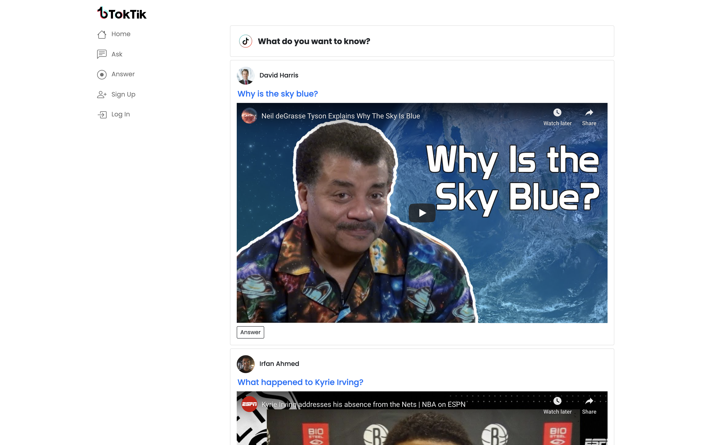
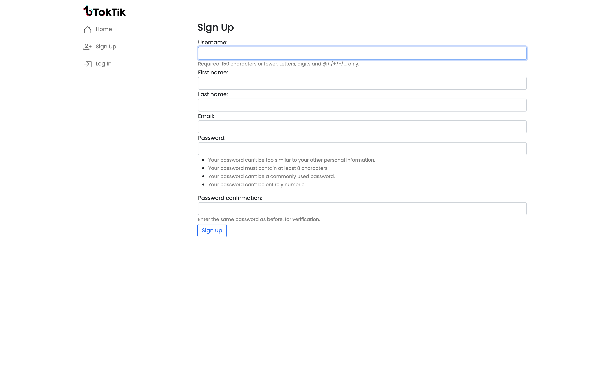
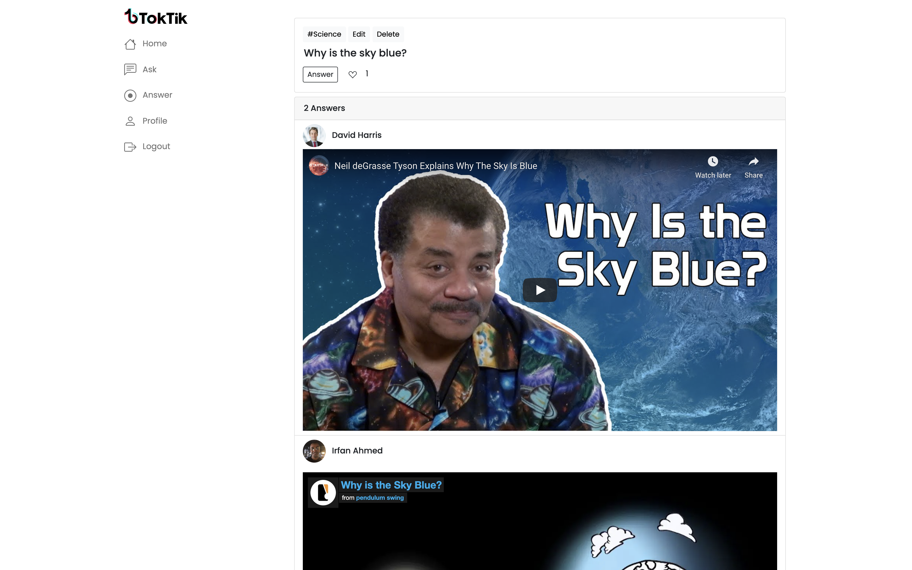
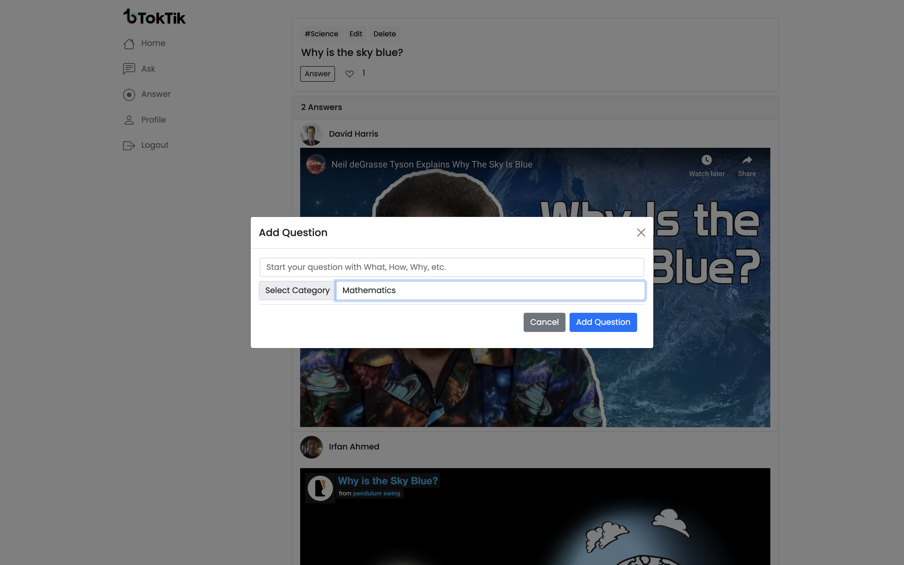
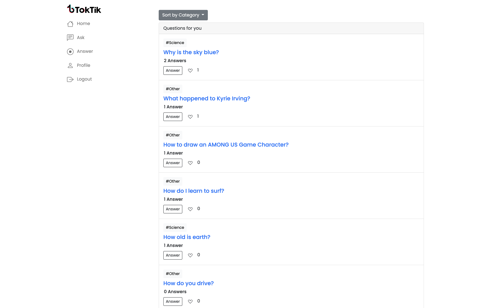
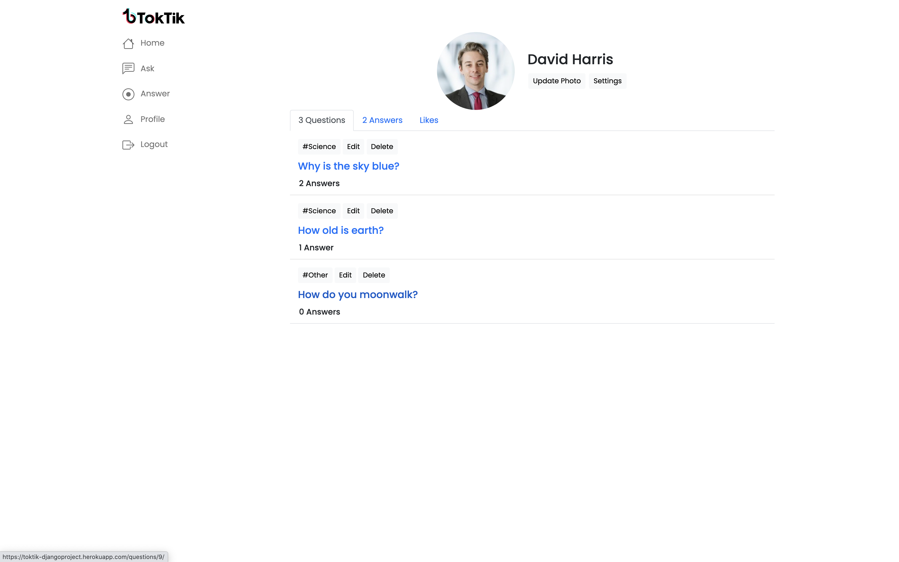

# toktik

Toktik is an online community where users can ask questions and get interactive video answers. By addin video responses to answers, users can show rather than just explain what they know, and help pass their knowledge along.

---

## Authors

David Harris, Ryan Lee, Irfan Ahmd

---

## Getting Started

https://toktik-djangoproject.herokuapp.com/

Scroll through the homepage to learn something new.
Make an account or login to ask your burning questions, or help someone out!

[Project Planning via Notion](https://www.notion.so/f0f81fcc1dd240559fe035950a491763?v=f9f0a53b585e4ca0a61e4b57bc3b57a9)

---

## Screenshots

### Landing Page

## 

### User Sign Up

## 

### Home Page

## 

### Add a Question

## 

### Question Page

## 

### Profile Page

## 

### Profile Page - Liked Answers

## 

---

## Technologies Used

- Django & Python
- PSQL
- Deployed on Heroku
- Styled with Bootstrap
- Video render with Micawber
- Database hosted with AWS Boto3

---

## Next Steps

1. **Search Questions:** Adding more functionality to the questions page, to allow users to search for questions that they want answered.

2. **Algorithmic Sorting of Feeds:** Add dynamic aspect to question and answer feeds to incorporate recent likes and upload time to determine which videos and answers are shown at the top of users feeds.

3. **Direct Upload:** Allow users to upload and add videos to the website directly, to improve site useability.

4. **Anonymous Feature:** Allow users to ask and answer questions anonymously, to improve user experience.

5. **Notifications:** Allow users to receive notifications when questions they've asked or like are answered.

6. **Comments:** Allow user comments on questions to improve dialogue on the application.
